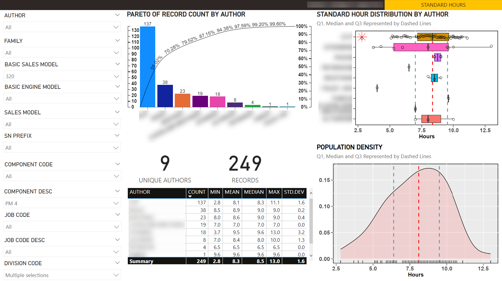

# Portfolio of Todd Takala

## LinkedIn

[https://www.linkedin.com/in/takala/](https://www.linkedin.com/in/takala/)

## DataCamp

### Personal Profile

* [https://www.datacamp.com/portfolio/takala](https://www.datacamp.com/portfolio/takala)
* [Assessment Badges](assessment-badges.md)

### Skill Assessments

DataCamp provides assessments for a range of topics within data science, including Python, R, SQL, machine learning, statistics, and more.

### Summary

#### Theory

| Assessment                                | Percentile    |
| ---                                       | ---:          |
| Understanding and Interpreting Data       | 98%           |

#### Python

| Assessment                                | Percentile    |
| ---                                       | ---:          |
| Python Programming                        | 98%           |
| Machine Learning Fundamentals in Python   | 99%           |
| Statistics Fundamentals with Python       | 97%           |
| Data Visualization with Python            | 95%           |
| Data Manipulation with Python             | 95%           |
| Importing and Cleaning Data with Python   | 99%           |

#### R

| Assessment                                | Percentile    |
| ---                                       | ---:          |
| R Programming                             | 94%           |
| Machine Learning Fundamentals in R        | 98%           |
| Statistics Fundamentals with R            | 97%           |
| Data Visualization with R                 | 87%           |
| Data Manipulation with R                  | 98%           |
| Importing and Cleaning Data with R        | 99%           |

##### SQL

| Assessment                                | Percentile    |
| ---                                       | ---:          |
| Data Management in SQL (PostgresSQL)      | 95%           |
| Data Analysis in SQL (PostgresSQL)        | 99%           |

## Dashboard Example

