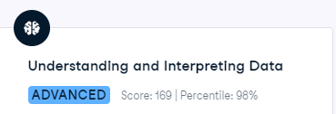
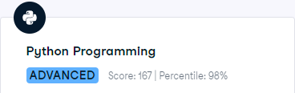
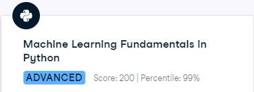
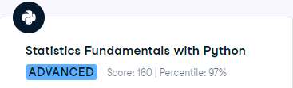

# Portfolio of Todd Takala

## DataCamp

### Skill Assessments

#### Theory

##### Understanding and Interpreting Data - Percentile: 98%

#### Python

##### Python Programming - Percentile - 98%

##### Machine Learning Findamentals in Python - Percentile - 99%

##### Statistics Fundamentals with Python - Percentile - 97%

##### Statistics Fundamentals with Python - Percentile - 95%

