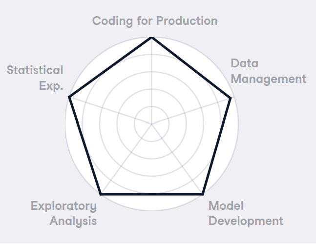

# Portfolio of Todd Takala

[Certifications](https://github.com/toddtakala/portfolio/tree/main/certs)

## LinkedIn          

[https://www.linkedin.com/in/takala/](https://www.linkedin.com/in/takala/)

## Projects

* [Investigating Netflix Movies and Guest Stars in The Office](https://app.datacamp.com/workspace/w/74364665-47ec-4448-a1d6-ece7d0d906aa)
* [Predicting Credit Card Approvals](https://app.datacamp.com/workspace/w/3cdac102-7205-4f80-bca6-914d31f21f23)
* [The GitHub History of the Scala Language](https://app.datacamp.com/workspace/w/1e012d05-2a5d-4e43-b098-d8980289d9a5)
* [The Android App Market on Google Play](https://app.datacamp.com/workspace/w/1124fc03-254b-4953-9a0f-edb01baeaa10)
* [A Visual History of Nobel Prize Winners](https://app.datacamp.com/workspace/w/ef91c9a9-4d2a-4b2e-864e-80e664591006)
* [Dr. Semmelweis and the Discovery of Handwashing](https://app.datacamp.com/workspace/w/b946c928-c8f0-460b-9928-e752829ea351)
* [Exploring the Bitcoin Cryptocurrency Market](https://app.datacamp.com/workspace/w/cce07406-8f83-4ccb-a49c-5f014580b6a8)

## Stack Exchange - Engineering

* [Stack Exchange - Engineering Profile](https://engineering.stackexchange.com/users/13416/todd-takala)

## DataCamp

### Personal Profile

* [https://www.datacamp.com/portfolio/takala](https://www.datacamp.com/portfolio/takala)
* [Assessment Badges](assessment-badges.md)

### Skill Assessments

DataCamp provides assessments for a range of topics within data science, including Python, R, SQL, machine learning, statistics, and more.

### Summary

#### Theory

| Assessment                                | Percentile    |
| ---                                       | ---:          |
| Understanding and Interpreting Data       | 98%           |

#### Python

| Assessment                                | Percentile    |
| ---                                       | ---:          |
| Python Programming                        | 98%           |
| Machine Learning Fundamentals in Python   | 99%           |
| Statistics Fundamentals with Python       | 97%           |
| Data Visualization with Python            | 95%           |
| Data Manipulation with Python             | 95%           |
| Importing and Cleaning Data with Python   | 99%           |

#### R

| Assessment                                | Percentile    |
| ---                                       | ---:          |
| R Programming                             | 94%           |
| Machine Learning Fundamentals in R        | 98%           |
| Statistics Fundamentals with R            | 97%           |
| Data Visualization with R                 | 96%           |
| Data Manipulation with R                  | 98%           |
| Importing and Cleaning Data with R        | 99%           |

##### SQL

| Assessment                                | Percentile    |
| ---                                       | ---:          |
| Data Management in SQL (PostgresSQL)      | 95%           |
| Data Analysis in SQL (PostgresSQL)        | 99%           |
