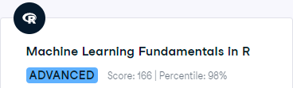
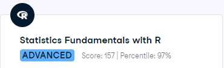
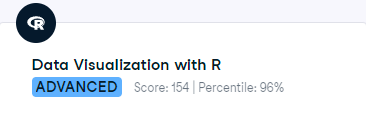
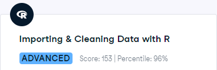
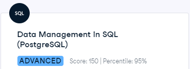
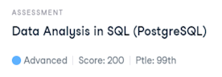

# Portfolio of Todd Takala

## LinkedIn

[https://www.linkedin.com/in/takala/](https://www.linkedin.com/in/takala/)

## DataCamp

### Personal Profile

[https://www.datacamp.com/portfolio/takala](https://www.datacamp.com/portfolio/takala)

### Skill Assessments

DataCamp provides assessments for a range of topics within data science, including Python, R, SQL, machine learning, statistics, and more.

#### Theory

##### Understanding and Interpreting Data - Percentile: 98%

#### Python

##### Python Programming - Percentile - 98%

##### Machine Learning Findamentals in Python - Percentile - 99%

##### Statistics Fundamentals with Python - Percentile - 97%

##### Data Visualization with Pytho- Percentile - 95%

##### Data Manipulation with Python - Percentile - 95%

##### Importing and Cleaning Data with Python - Percentile - 99%

#### R

##### R Programming - Percentile - 94%

##### Machine Learning Findamentals in R - Percentile - 98%

##### Statistics Fundamentals with R - Percentile - 97%

##### Data Visualization with R - Percentile - 87%

##### Data Manipulation with R - Percentile - 98%

##### Importing and Cleaning Data with R - Percentile - 99%

#### SQL

##### Data Management in SQL (PostgresSQL) - Percentile - 95%

##### Machine Learning Findamentals in R - Percentile - 99%

