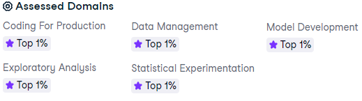

# Portfolio of Todd Takala

## My Certifications

* [Certifications](https://github.com/toddtakala/portfolio/tree/main/certifications) 
* [Certificates of Completion](https://github.com/toddtakala/portfolio/tree/main/certs) 

## Profiles

* [LinkedIn](https://www.linkedin.com/in/takala/)
* [Stack Exchange - Engineering Profile](https://engineering.stackexchange.com/users/13416/todd-takala)
* [DataCamp Profile](https://www.datacamp.com/portfolio/takala)

## Awards and Honors

### Champion - Amazon Machine Learning Competition
#### Issued by Amazon Machine Learning University · Sep 2022

Twice winner of machine learning competitions at Amazon for Regression and Binary Classification data science competitions.

### Guest Speaker: Data Science Applications for Fleet Reliability
#### Issued by Caterpillar Inc. · May 2021

Shared machine learning methodology to predict diesel engine life in large off-highway trucks. Life was extended by 33%.

### Guest Speaker: Truck Rebuild Program
#### Issued by Caterpillar Inc. · Apr 2019

Spoke at Caterpillar large mining truck conference to discuss Empire-Cat’s truck rebuild program. Empire will completely rebuild a mining haul trucks at 60% of the cost of a new machine and operates with 2 to 4% more physical availability above trucks from the factory.

### Guest Speaker: Product Problem Management
#### Issued by Caterpillar Inc. · Sep 2015

Discussed Empire's reliability engineering program which involves a focus on "find it" using RCA, critical component life analysis, inspections, telematics, and condition monitoring, followed by identifying key factors using machine learning, and then implementing "fix it" solutions through interim corrective actions and working with Caterpillar's FMEA process for permanent solutions.

## Projects

* 
* [A Visual History of Nobel Prize Winners](https://app.datacamp.com/workspace/w/ef91c9a9-4d2a-4b2e-864e-80e664591006)
* [Cleaning Bank Marketing Campaign Data](https://app.datacamp.com/workspace/w/ad74b952-aebc-41e0-a56d-b4ea1ea411fe/)
* [Dr. Semmelweis and the Discovery of Handwashing](https://app.datacamp.com/workspace/w/b946c928-c8f0-460b-9928-e752829ea351)
* [Exploring NYC Public School Test Result Scores](https://app.datacamp.com/workspace/w/909d8bd1-53d3-4111-ac6b-d034df3488e7/)
* [Exploring the Bitcoin Cryptocurrency Market](https://app.datacamp.com/workspace/w/cce07406-8f83-4ccb-a49c-5f014580b6a8)
* [Investigating Netflix Movies and Guest Stars in The Office](https://app.datacamp.com/workspace/w/74364665-47ec-4448-a1d6-ece7d0d906aa)
* [Mobile Games AB Testing with Cookie Cats](resources/projects/Mobile_Games_AB_Testing_with_Cookie_Cats/notebook.ipynb)
* [Name Game: Gender Prediction using Sound](https://app.datacamp.com/workspace/w/c7de08d4-6848-4b01-97fc-1161fcb1a29b/)
* [Predicting Credit Card Approvals](https://app.datacamp.com/workspace/w/3cdac102-7205-4f80-bca6-914d31f21f23)
* [Predicting High Traffic for a Website](https://app.datacamp.com/workspace/w/ccde9b8c-ca12-433f-9e77-773cbc879ad2)
* [The Android App Market on Google Play](https://app.datacamp.com/workspace/w/1124fc03-254b-4953-9a0f-edb01baeaa10)
* [The GitHub History of the Scala Language](https://app.datacamp.com/workspace/w/1e012d05-2a5d-4e43-b098-d8980289d9a5)

## DataCamp

### Personal Profile

* [DataCamp Portfolio](https://www.datacamp.com/portfolio/takala)
* [Assessment Badges](assessment-badges.md)

### Skill Assessments

DataCamp provides assessments for a range of topics within data science, including Python, R, SQL, machine learning, statistics, and more.

### Summary

#### Python

| Assessment                                | Percentile    |
| ---                                       | ---:          |
| Data Manipulation with Python             | 95th          |
| Data Visualization with Python            | 95th          |
| Importing and Cleaning Data with Python   | 99th          |
| Machine Learning Fundamentals in Python   | 99th          |
| Programming for Data Engineering          | 99th          |
| Python Programming			            | 98th          |
| Statistics Fundamentals with Python       | 97th          |

#### R

| Assessment                                | Percentile    |
| ---                                       | ---:          |
| Data Manipulation with R                  | 98th          |
| Data Visualization with R                 | 96th          |
| Importing and Cleaning Data with R        | 96th          |
| Machine Learning Fundamentals in R        | 98th          |
| R Programming                             | 98th          |
| Statistics Fundamentals with R            | 97th          |

##### SQL

| Assessment                                | Percentile    |
| ---                                       | ---:          |
| Data Analysis in SQL (PostgresSQL)        | 99th          |
| Data Management in SQL (PostgresSQL)      | 95th          |

| Assessment                                | Percentile    |
| ---                                       | ---:          |
| AI Fundamentals                           | 99th          |
| Analytic Fundamentals                     | 97th          |
| Data Management Theory                    | 97th          |
| Data Storytelling                         | 95th          |
| Data Visualization Theory                 | 99th          |
| Exploratory Analysis Theory               | 95th          |
| Statistical Experimentation Theory        | 99th          |
| Understanding and Interpreting Data       | 98th          |

#### Python

| Assessment                                | Percentile    |
| ---                                       | ---:          |
| Data Manipulation with Python             | 95th          |
| Data Visualization with Python            | 95th          |
| Importing and Cleaning Data with Python   | 99th          |
| Machine Learning Fundamentals in Python   | 99th          |
| Programming for Data Engineering          | 99th          |
| Python Programming			            | 98th          |
| Statistics Fundamentals with Python       | 97th          |

#### R

| Assessment                                | Percentile    |
| ---                                       | ---:          |
| Data Manipulation with R                  | 98th          |
| Data Visualization with R                 | 96th          |
| Importing and Cleaning Data with R        | 96th          |
| Machine Learning Fundamentals in R        | 98th          |
| R Programming                             | 98th          |
| Statistics Fundamentals with R            | 97th          |

##### SQL

| Assessment                                | Percentile    |
| ---                                       | ---:          |
| Data Analysis in SQL (PostgresSQL)        | 99th          |
| Data Management in SQL (PostgresSQL)      | 95th          |
