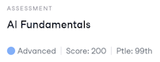
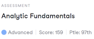
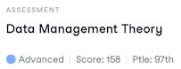
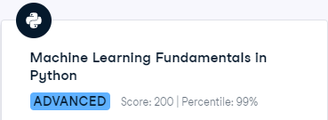

# Portfolio of Todd Takala

## DataCamp

### Personal Profile

[https://www.datacamp.com/portfolio/takala](https://www.datacamp.com/portfolio/takala)

### Skill Assessment Badges

DataCamp provides assessments for a range of topics within data science, including Python, R, SQL, machine learning, statistics, and more.

#### Theory

##### AI Fundamentals - Percentile: 99th

##### Analytic Fundamentals - Percentile 97th

##### Data Management Theory - Percentile: 97th

##### Data Storytelling - Percentile: 95th

##### Statistical Experimentation Theory - Percentile: 99th

##### Data Visualization Theory - Percentile: 99th

##### Understanding and Interpreting Data - Percentile: 98th

#### Python

##### Data Manipulation with Python - Percentile - 95th

##### Data Visualization with Python - Percentile - 95th

##### Importing and Cleaning Data with Python - Percentile - 99th

##### Machine Learning Findamentals in Python - Percentile - 99th

##### Programming for Data Engineering - Percentile - 99th

##### Python Programming - Percentile - 98th

##### Statistics Fundamentals with Python - Percentile - 97th

#### R

##### Data Manipulation with R - Percentile - 98th

##### Data Visualization with R - Percentile - 96th

##### Importing and Cleaning Data with R - Percentile - 99th

##### R Programming - Percentile - 98th

##### Machine Learning Findamentals in R - Percentile - 98th

##### Statistics Fundamentals with R - Percentile - 97th

#### SQL

##### Data Management in SQL (PostgresSQL) - Percentile - 95th

##### Data Analysis in SQL (PostgresSQL) - Percentile - 99th

