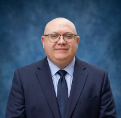

# Todd Takala's Portfolio

[in/toddtakala](https://www.linkedin.com/in/toddtakala)

Professional with 25 years in capital equipment reliability and engineering. Started on the shop floor as a mechanic and welder, later earned mechanical engineering degree. Expert in ML, predictive maintenance, and reliability engineering—trusted by both technicians and executives. Proficient across software development lifecycle, MLOps, and building data-driven products from failure data, IoT, and ERP systems.

## Awards and Honors

### CEO Award (Labor Time Machine Learning)

_Jim Umpleby, Caterpillar Inc. - May 2024_

Developed AI-driven solutions that reduced labor costs and earned the CEO award for exceptional personal contributions and business impact.

### 2x Champion: Amazon Machine Learning Competition

_Amazon Machine Learning University - September 2022_

2x winner of machine learning internal competitions at Amazon.com for Regression and Binary Classification data science competitions.

### Invited Speaker: Data Science Applications for Fleet Reliability

_Caterpillar Inc. - May 2021_

Shared diesel engine digital twin for large off-highway trucks. Life was extended by 33%, which saved our client $62M in the first 90 days.

### Invited Speaker: Truck Rebuild Program

_Caterpillar Inc. - April 2019_

Spoke at Caterpillar large mining truck conference to discuss Empire-Cat’s truck rebuild program. Empire will completely rebuild a mining haul trucks at 60% of the cost of a new machine and operates with 2 to 4% more physical availability above trucks from the factory.

### Invited Speaker: Product Problem Management

_Caterpillar Inc. - September 2015_

Discussed Empire's reliability engineering program which involves a focus on "find it" using RCA, critical component life analysis, inspections, telematics, and condition monitoring, followed by identifying key factors using machine learning, and then implementing "fix it" solutions through interim corrective actions and working with Caterpillar's FMEA process for permanent solutions.

## Certifications

| Name | Issued By |
| ---  | ---       |
| [AWS Certified Machine Learning - Specialty (MLS-C01)](https://www.credly.com/badges/65a3c7d5-1977-4c71-94d6-2d016ea1fe29) | Amazon Web Services |
| [Six Sigma Black Belt](https://www.coursera.org/account/accomplishments/specialization/3EOLHJ57IMRP) | Kennesaw State University |
| [SAFe 6 Agilist](https://www.credly.com/badges/a4c2f671-694e-46f5-bdd1-a1025d0e3b00) | SAFe by Scaled Agile, Inc. |
| Applied Failure Analysis | Caterpillar Inc. |
| Certified Technical Communicator | Komatsu North America |
| [Fundamentals of Flight Mechanics](https://www.coursera.org/account/accomplishments/specialization/VYE4OV5XDPW8) | ISAE - Supaero |
| [Semiconductor Packaging](https://www.coursera.org/account/accomplishments/specialization/AAGBCPUY6CW2) | Arizona State University |
| [Probabilistic Graphical Models](https://www.coursera.org/account/accomplishments/specialization/H2GYUKL51ESK) | Stanford University |
| [AI for Mechanical Engineers](https://www.coursera.org/account/accomplishments/specialization/5ADKOPJUDPHV) | University of Michigan |
| [Applied Python Data Engineering](https://www.coursera.org/account/accomplishments/specialization/TTKGZKR2MW48) | Duke University |
| [Advanced Deep Learning Specialist](https://www.credly.com/badges/c0442903-5f35-4a0f-8fa9-ec034ee3c092) | IBM |
| [RAG and Agentic AI](https://www.coursera.org/account/accomplishments/professional-cert/1XWIEFNB5MPF) | IBM |
| [Deep Learning with PyTorch, Keras and Tensorflow](https://www.coursera.org/account/accomplishments/professional-cert/O12BBM4K4R9L) | IBM |
| [Building AI Agents and Agentic Workflows](https://www.coursera.org/account/accomplishments/specialization/ELTSTT0PO1GQ) | IBM |
| [The Science of Happiness at Work](https://credentials.edx.org/credentials/139917b546984a14980b2d10f9684455/) | University of California, Berkeley |

## Projects

* [A Visual History of Nobel Prize Winners](https://app.datacamp.com/workspace/w/ef91c9a9-4d2a-4b2e-864e-80e664591006)
* [Cleaning Bank Marketing Campaign Data](https://app.datacamp.com/workspace/w/ad74b952-aebc-41e0-a56d-b4ea1ea411fe/)
* [Dr. Semmelweis and the Discovery of Handwashing](https://app.datacamp.com/workspace/w/b946c928-c8f0-460b-9928-e752829ea351)
* [Exploring NYC Public School Test Result Scores](https://app.datacamp.com/workspace/w/909d8bd1-53d3-4111-ac6b-d034df3488e7/)
* [Exploring the Bitcoin Cryptocurrency Market](https://app.datacamp.com/workspace/w/cce07406-8f83-4ccb-a49c-5f014580b6a8)
* [Investigating Netflix Movies and Guest Stars in The Office](https://app.datacamp.com/workspace/w/74364665-47ec-4448-a1d6-ece7d0d906aa)
* [Name Game: Gender Prediction using Sound](https://app.datacamp.com/workspace/w/c7de08d4-6848-4b01-97fc-1161fcb1a29b/)
* [Predicting Credit Card Approvals](https://app.datacamp.com/workspace/w/3cdac102-7205-4f80-bca6-914d31f21f23)
* [The Android App Market on Google Play](https://app.datacamp.com/workspace/w/1124fc03-254b-4953-9a0f-edb01baeaa10)
* [The GitHub History of the Scala Language](https://app.datacamp.com/workspace/w/1e012d05-2a5d-4e43-b098-d8980289d9a5)